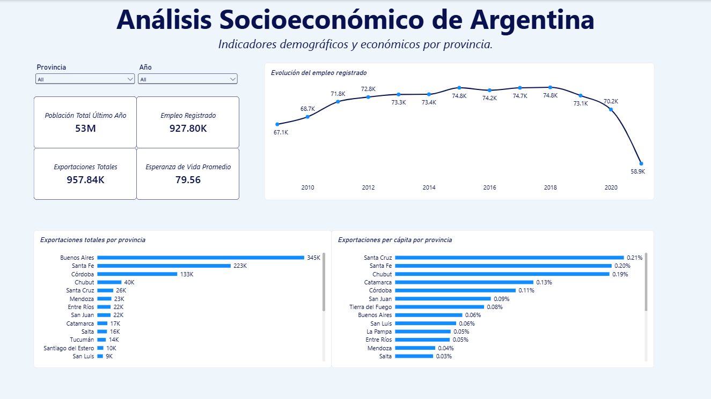
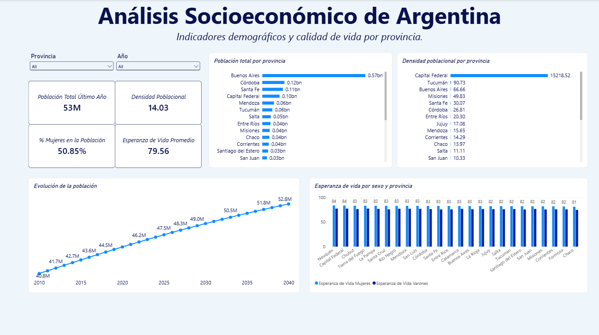
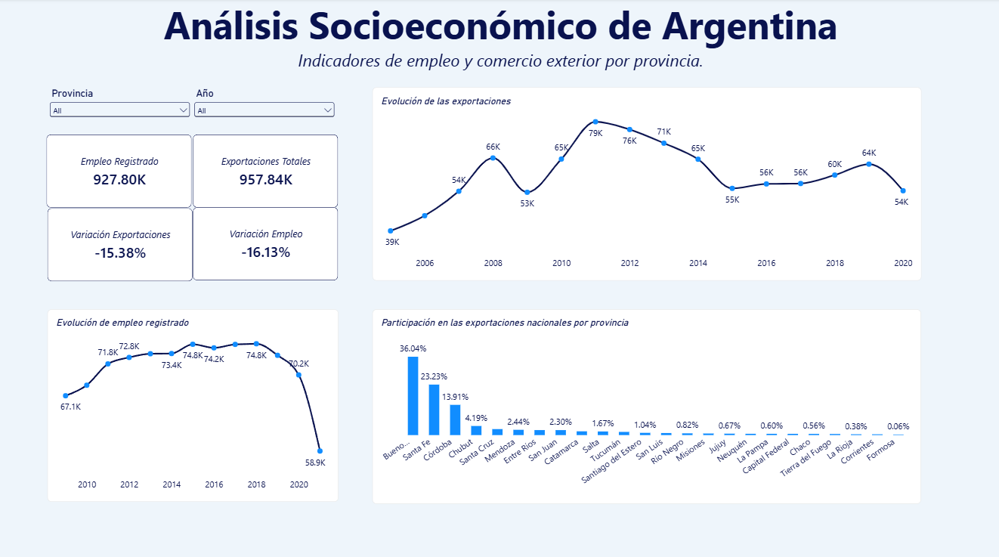

# Análisis Socioeconómico de Argentina

Proyecto desarrollado en Power BI para analizar distintos indicadores socioeconómicos de las provincias argentinas.

El análisis combina información de población, esperanza de vida, empleo registrado y exportaciones, con el objetivo de comparar las provincias y observar la evolución de los principales indicadores a lo largo del tiempo.

## Objetivo

El objetivo del proyecto fue construir un dashboard interactivo que permitiera integrar distintas fuentes de datos y presentar la información de una forma clara y fácil de analizar.

Para desarrollarlo trabajé en las distintas etapas del proceso de Business Intelligence:

- Limpieza y transformación de los datos con Power Query
- Construcción del modelo de datos
- Creación de relaciones entre las tablas
- Creación de medidas y KPIs utilizando DAX
- Análisis de la evolución temporal de los indicadores
- Comparación de resultados entre provincias
- Diseño del dashboard en Power BI

## Herramientas utilizadas

- Power BI Desktop
- Power Query
- DAX
- CSV
- GitHub

## Modelo de datos

Para organizar la información armé un modelo compuesto por tablas de hechos y dimensiones.

Las principales tablas utilizadas fueron:

- `Dim_Provincia`
- `Dim_Fecha`
- `Fact_Poblacion`
- `Fact_Empleo`
- `Fact_Exportaciones`
- `Fact_EsperanzaVida`

`Dim_Provincia` permite relacionar la información correspondiente a cada provincia, mientras que `Dim_Fecha` permite realizar el análisis temporal de los distintos indicadores.

## Indicadores analizados

Entre los principales indicadores incluidos en el dashboard se encuentran:

- Población total
- Densidad poblacional
- Porcentaje de mujeres en la población
- Esperanza de vida
- Empleo registrado
- Exportaciones totales
- Exportaciones per cápita
- Variación interanual del empleo
- Variación interanual de las exportaciones
- Participación de cada provincia en las exportaciones nacionales

## Dashboard

El reporte está dividido en tres páginas.

### Resumen General

Presenta una vista general de los principales indicadores y permite comparar rápidamente la situación de las distintas provincias.



### Demografía

Incluye indicadores relacionados con población, densidad poblacional y esperanza de vida, además de su evolución a lo largo del tiempo.



### Economía

Se concentra en los indicadores de empleo y comercio exterior, incluyendo la evolución del empleo registrado, las exportaciones y la participación de cada provincia en el total nacional.



## Interactividad

El dashboard cuenta con filtros por provincia y año.

Estos filtros permiten analizar los indicadores a nivel nacional o seleccionar una provincia en particular y observar su comportamiento en distintos períodos.

## Estructura del repositorio

```text
analisis-socioeconomico-argentina/
│
├── README.md
├── Análisis Socioeconómico de Argentina.pbix
├── medidas-dax.md
├── resumen-general.png
├── demografía.png
├── economía.png
│
└── data/
    ├── README.md
    └── archivos CSV utilizados
```

## Sobre el proyecto

Este proyecto fue realizado como parte de mi portfolio de Data Analytics y Business Intelligence.
